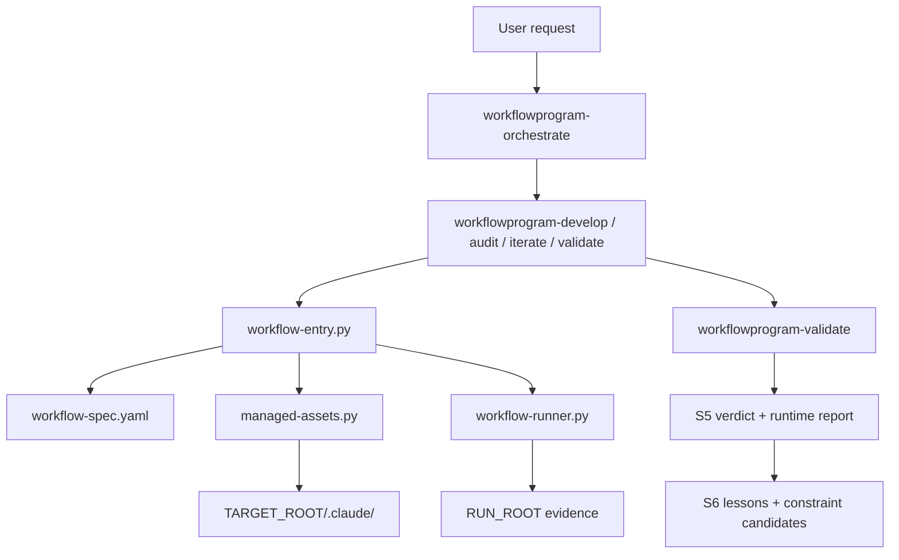

# WorkflowProgram 101: Designing Workflows As Products

[中文](workflowprogram-101.md) | [English](workflowprogram-101.en.md)

> Do not treat a workflow as a pile of prompts. Treat it as something that can be designed, delivered, validated, and iterated.

Chapter-based entry:

- [English chapter guide](./workflowprogram-101-en/index.md)
- [English HTML tutorial](./workflowprogram-101-html/index.en.html)

## What Is This?

This is an English overview tutorial built around the current `WorkflowProgram-CN` implementation.

It follows the spirit of `Workflow101`, but the case study is not a review bot. The case study is `WorkflowProgram` itself:

- it is a meta-workflow repository for the Claude Code ecosystem
- it does not directly deliver business code
- it delivers `.claude/` workflow assets into a target project
- it also requires those assets to be verifiable, traceable, and iterable

In other words, WorkflowProgram is not mainly about "how to write a prompt". It is about "how to make a workflow into a maintainable product".

## What Are We Building?

Start from the smallest real entry:

```text
/workflowprogram-develop "Design a Claude Code workflow for this project"
```

Behind that single entry, the current implementation does all of this:

1. identify the intent and the target directory
2. generate `workflow-spec.md` and `workflow-spec.yaml`
3. generate `workflow-view.md`, `workflow-lowlevel.md`, and the target-side runtime wrapper bundle
4. write candidate `.claude/` and `.workflowprogram/` assets into `RUN_ROOT/outputs/candidate/`
5. use managed apply to decide what may safely land in `TARGET_ROOT`
6. if external capabilities are declared, run capability discovery, host probing, bootstrap, and remediation guidance first
7. persist control-plane evidence such as `state.json` and `events.jsonl`
8. run `workflowprogram-validate` to produce a workflow-level verdict
9. write lessons, constraint candidates, and next-step suggestions back into the S6 loop

That is the core design philosophy of WorkflowProgram: **a workflow is not a one-shot generated artifact. It is a product pipeline with a control plane, evidence chain, and feedback loop**.

## Who Is This For?

- developers already using Claude Code, but whose workflows still look like a few hand-written prompt files
- teams that want `.claude/` assets to be reusable deliverables
- readers who want to understand why WorkflowProgram has a runner, an S5 judge, a `RUN_ROOT`, and lessons

## The Common Workflow Problems It Tries To Fix

| Problem | What Happens Without A Fix | WorkflowProgram's Response |
|----------|----------------------------|----------------------------|
| No single truth source | Docs, prompts, and implementation drift | Converge on one machine-readable truth source |
| Order depends on model memory | Steps are skipped, repeated, or reordered | Move key sequencing into deterministic programs |
| Target project gets written directly | Recovery and ownership become unclear | Write into an isolated candidate area, then use managed apply |
| Failures are hard to localize | You cannot tell design from execution issues | Separate design, execution, judgment, and evidence capture |
| Evidence is weak | You can only inspect chat logs | Persist context, state, events, and reports |
| Validation only checks exit codes | "Finished" is confused with "correct" | Separate runtime constraints, test constraints, and final verdict |
| External dependencies are not checked before the run | Missing skills, MCP servers, or CLIs cause mid-run failure | Discover capabilities first, then probe the host and generate remediation guidance |
| Parallel collaboration stays implicit | Multiple agents work at once, but there is no structured fan-out or join evidence | Use an explicit team contract to declare fan-out, join policy, and evidence |
| Lessons never flow back | The same failures repeat | Separate per-run lessons from long-lived rules |
| Natural-language entry is unstable | Similar requests route into different flows | Detect intent and route before entering the main flow |

So WorkflowProgram is not about adding more skills. It is about systematically turning workflow failure modes into design, control-plane, and validation objects.

## The Most Important Concepts

| Concept | What It Solves | Current Implementation |
|------|------|------|
| `PLUGIN_ROOT` | Where plugin assets come from | `dist/plugin/` or the source `.claude/` tree |
| `TARGET_ROOT` | Where the workflow is delivered | the target project directory |
| `RUN_ROOT` | Where runtime evidence lives | `TARGET_ROOT/.workflowprogram/runs/<run-id>/` |
| `workflowprogram-orchestrate` | How natural-language requests route into the right flow | `route-intent.py` + orchestrate skill |
| `workflow-spec.yaml` | Where the machine-readable truth source lives | the control-plane spec produced in S3 |
| `intent_flows` | Which logical stages each intent must pass through | the intent-to-stage truth source inside the spec |
| `workflow-entry.py` | How the main path becomes deterministic | product entry wrapper |
| `workflow-runner.py` | Who owns transitions and runtime constraints | control-plane runner |
| `workflowprogram-validate` | Who produces the workflow-level verdict | S5 judge entry |
| `workflow-lowlevel.md` | Where maintenance and iteration guidance comes from | a one-way render from YAML |
| `runtime-manifest.json` | Whether the target-side runtime was really delivered | the machine contract inside `.workflowprogram/runtime/` |
| `capability_discovery` / `host_capabilities` | How external capabilities are discovered, probed, and repaired | candidate reports, host reports, remediation guidance |
| `agent_team_contract` | When Team orchestration is explicitly enabled | fan-out / join / evidence contract |
| `lessons.md` / `constraints.md` | How experience survives into the next run | S6 feedback loop |

The relationship looks like this:



In one sentence:

- the spec defines how the workflow should run
- the entry and runner make it run deterministically
- the validator decides whether it passed
- lessons and constraints make the next run more stable

## Tutorial Structure

This tutorial follows the same chapter flow as the Chinese version:

1. why WorkflowProgram is not a prompt-template repository
2. why `PLUGIN_ROOT / TARGET_ROOT / RUN_ROOT` must be separated
3. why there is an `S0..S6` stage model
4. why there is a deterministic entry wrapper and runner
5. why writes must go through candidate -> managed apply
6. why validation must remain independent from generation
7. why lessons belong in S6
8. how to reuse the whole design in your own workflow

## The Productization Test

To judge whether a workflow is really becoming a product, ask these five questions:

1. Can I clearly name the truth source?
2. Can I clearly name who owns state transitions?
3. Can I clearly name who produces the final verdict?
4. Can I clearly name where evidence is written?
5. Can I clearly name how failed runs influence the next run?

If those answers are vague, the workflow is still closer to a prompt bundle than to a product.
