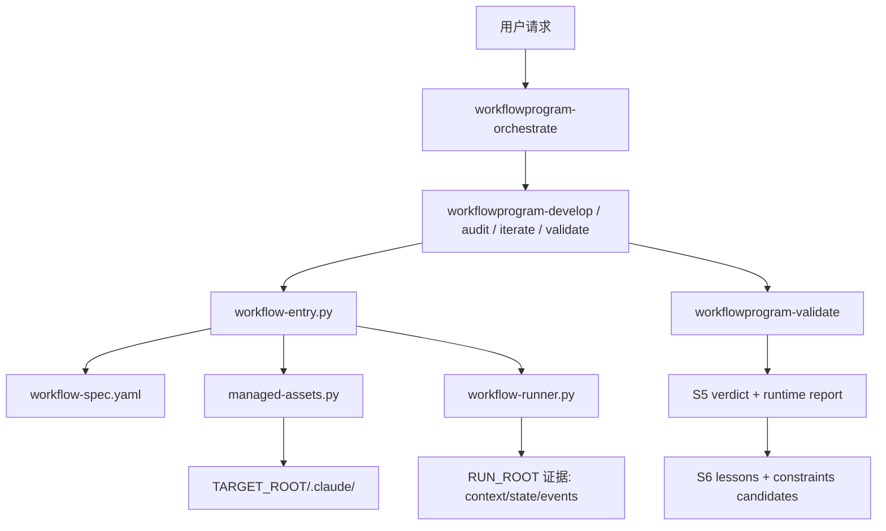

# WorkflowProgram 101：把工作流当成产品来设计（单页版）

> 别把工作流当成一段提示词拼装。它应该像产品一样被设计、交付、验证和迭代。

章节版入口：

- [WorkflowProgram 101 章节首页](./workflowprogram-101/index.md)

## 这是什么？

这是一份面向 `WorkflowProgram-CN` 当前实现的入门教程。

它参考 `Workflow101` 的写法，但实践案例不是 Review Bot，而是 `WorkflowProgram` 自己：

- 它是一个面向 Claude Code 生态的元工作流仓库
- 它不直接交付业务代码
- 它交付的是目标项目中的 `.claude/` workflow 资产
- 它还要求这些资产可以被验证、追踪和持续迭代

换句话说，`WorkflowProgram` 想解决的问题不是“怎么写一个 prompt”，而是“怎么把一个 workflow 做成一个可维护的产品”。

## 我们要构建什么？

先看一个最小使用场景：

```text
/workflowprogram-cn:workflowprogram-orchestrate "为当前项目设计一个 Claude Code 工作流"
```

这一条入口背后，当前实现做的事情是：

1. 识别意图和目标目录
2. 生成 `workflow-spec.md` 和 `workflow-spec.yaml`
3. 生成 `workflow-view.md`、`workflow-maintenance.md` 和目标侧 runtime 包装层
4. 把候选 `.claude/` 与 `.workflowprogram/` 资产先写到 `RUN_ROOT/outputs/candidate/`
5. 通过 managed apply 决定哪些文件可以安全落到 `TARGET_ROOT`
6. 若声明外部能力依赖，先做能力发现、宿主探测、bootstrap 与环境修复指引
7. 用 runner 落盘 `state.json`、`events.jsonl` 等控制面证据
8. 用 `workflowprogram-validate` 给出 workflow 级验证结论
9. 把 lessons、约束候选和下一轮建议写回 S6 闭环

这就是 `WorkflowProgram` 的核心设计哲学：**workflow 不是一次性生成物，而是一条有控制面、有证据链、有迭代闭环的产品流水线。**

## 适合谁？

- 已经在用 Claude Code，但 workflow 还停留在“手写几个 prompt 文件”的开发者
- 想把 `.claude/` 资产做成团队可复用交付物的人
- 想理解“为什么 WorkflowProgram 要有 runner、S5 judge、RUN_ROOT、lessons”这些看起来比较重的设计的人

## 工作流编排里常见的问题，WorkflowProgram 在补什么

如果把这套设计抽象掉具体文件名，`WorkflowProgram` 主要在解决下面这些常见问题：

| 常见问题 | 没解决时会怎样 | WorkflowProgram 的设计思路 |
|----------|----------------|----------------------------|
| 没有统一真源 | 文档、提示词、实现相互漂移 | 先收口到机器可读的设计真源 |
| 编排顺序靠模型记忆 | 容易漏步骤、跳步骤、重复步骤 | 把关键顺序沉到确定性程序里 |
| 目标仓被直接写坏 | 一旦出错很难回退和追责 | 先写隔离候选区，再做受控应用 |
| 失败后无法定位问题层 | 不知道是设计、执行还是验证出了错 | 把设计、执行、判定、补证据拆层 |
| 没有结构化证据 | 只能看聊天记录，无法自动复盘 | 固定留下上下文、状态、事件和报告 |
| 验证只看命令退出码 | “执行成功”不等于“按约束执行成功” | 把运行约束、测试约束和最终判定拆开 |
| 工作流依赖外部能力，但运行前没人确认 | 缺 skill、MCP、CLI 时直接在中途失败 | 先做能力发现，再做宿主探测和环境修复指引 |
| 并行协作只停留在口头约定 | 多个 agent 同时工作但没有结构化 fan-out / join 证据 | 用显式 team 契约声明 fan-out、join 和证据 |
| 经验不会回流 | 下一轮继续重复踩坑 | 把单次总结和长期规则分开管理 |
| 自然语言入口不稳定 | 同类请求路由到不同技能，行为漂移 | 先做入口识别和意图路由 |

所以 `WorkflowProgram` 的思路不是“多写几个技能（skill）”，而是把工作流编排里最常见的失控点逐个变成设计对象、控制面对象和验证对象。

## 先看全景：WorkflowProgram 里几个最重要的概念

| 概念 | 解决什么问题 | 当前实现对应物 |
|------|--------------|----------------|
| `PLUGIN_ROOT` | 插件源码/运行时资产放哪 | `dist/plugin/` 或源码仓 `.claude/` |
| `TARGET_ROOT` | 工作流最终交付给谁 | 目标项目目录 |
| `RUN_ROOT` | 这次运行的证据放哪 | `TARGET_ROOT/.workflowprogram/runs/<run-id>/` |
| `workflowprogram-orchestrate` | 自然语言到底该路由到哪个主入口 | `route-intent.py` + `workflowprogram-orchestrate` |
| `workflow-spec.yaml` | 机器可读真源在哪 | S3 产出的控制面 spec |
| `intent_flows` | 不同意图至少应经过哪些逻辑阶段 | spec 中的意图到阶段流真源 |
| `workflow-entry.py` | 主入口如何变成固定脚本链 | 产品入口确定性 wrapper |
| `workflow-runner.py` | 谁负责状态转移和硬约束 | 控制面 runner |
| `workflowprogram-validate` | 谁给最终 workflow 级 verdict | S5 主 judge |
| `workflow-maintenance.md` | 维护与迭代说明从哪来 | 由 YAML 单向渲染的维护指导 |
| `target design source` | 目标 workflow 的设计理由、节点细节、验收与 traceability 放哪 | `TARGET_ROOT/.workflowprogram/design/source/**` |
| `runtime-manifest.json` | 目标侧 runtime 是否真的交付了 | `.workflowprogram/runtime/` 的机器契约 |
| `capability_discovery` / `host_capabilities` | 外部能力怎么发现、探测和修复 | 能力候选、宿主报告、修复指引 |
| `agent_team_contract` | Team 编排何时算显式开启 | fan-out / join / evidence 契约 |
| `lessons.md` / `constraints.md` | 经验如何积累并影响下一轮 | S6 闭环 |

它们的关系可以先这么理解：



目标 workflow 的设计要分两层看：`workflow-spec.yaml` 是机器控制面和运行态地图；`target-design-overview.md`、`target-design-detail.md`、`target-acceptance-tests.yaml`、`target-traceability-matrix.json` 是目标设计源。develop 成功后，这些设计源会归档到 `TARGET_ROOT/.workflowprogram/design/source/**`，后续修改、审计、validate 和 publish 都应读取这份归档，而不是只依赖一次性聊天上下文。

一句话总结：

- `spec` 定义应该怎么跑
- `entry + runner` 负责真正把它跑起来
- `validate` 负责判断跑得对不对
- `lessons + constraints` 负责让下一轮跑得更稳

## 教程结构

这份教程按 `Workflow101` 的方式组织，每一章都尽量回答一个明确问题：

1. 为什么 `WorkflowProgram` 不是“prompt 模板仓库”
2. 为什么它一定要区分 `PLUGIN_ROOT / TARGET_ROOT / RUN_ROOT`
3. 为什么要有 `S0..S6` 阶段模型
4. 为什么要有 `workflow-entry.py` 和 `workflow-runner.py`
5. 为什么写入必须是 candidate -> managed apply
6. 为什么验证必须独立于生成
7. 为什么经验积累必须进入 S6
8. 如何把这一整套思路迁移到你自己的目标 workflow

---

# Ch1: 设计哲学 — Workflow 不是 Prompt，而是产品

## 1.1 场景引入

很多 workflow 仓库一开始都很轻：

- 写几个 `SKILL.md`
- 补几个 `agents/*.md`
- 手动维护 `settings.json`
- 跑得通就算完成

问题是，一旦开始多人协作，马上会遇到这些问题：

- 谁能改目标项目里的哪些文件
- 这次运行到底改了什么
- 是 spec 设计错了，还是生成实现错了
- 这次失败留下了什么经验
- 下一轮运行怎么避免再犯

`WorkflowProgram` 的答案是：**把 workflow 当成产品，而不是 prompt 集合。**

产品化意味着至少有 4 件事：

1. 有真源：`workflow-spec.yaml`
2. 有控制面：`workflow-entry.py` + `workflow-runner.py`
3. 有验证：`workflowprogram-validate`
4. 有闭环：`S6 lessons & constraints`

## 1.2 当前实现怎么体现这件事

这一层的真源主要是：

- `docs/workflowprogram-stage-highlevel-design.md`
- `docs/workflowprogram-stage-lowlevel-design.md`
- `.claude/scripts/workflow-entry.py`
- `.claude/scripts/workflow-runner.py`

高层设计明确写了 3 个关键判断：

- `workflow-spec.yaml` 是控制面真源
- Runner 只负责控制面，不负责 S5 主判定
- S5 和 S6 分别负责“验证结论”和“经验闭环”

这跟“一个大 prompt 把所有事都做完”的思路正好相反。

## 1.3 提炼模板

如果你要判断一个 workflow 是否已经产品化，可以先问 4 个问题：

1. 机器可读真源是什么？
2. 控制面是谁负责？
3. 最终验证由谁负责？
4. 失败经验沉淀到哪里？

这 4 个问题答不上来，通常说明这个 workflow 还停留在 prompt 组装阶段。

---

# Ch2: 三层目录模型 — 为什么一定要区分 PLUGIN_ROOT、TARGET_ROOT、RUN_ROOT

## 2.1 设计思维

`WorkflowProgram` 当前实现最重要的基础模型之一，就是三层目录分离：

- `PLUGIN_ROOT`：插件运行时载荷
- `TARGET_ROOT`：目标项目，最终交付物所在地
- `RUN_ROOT`：本次执行的隔离证据目录

如果这三层不分开，会出现两个典型问题：

- 插件源码和目标项目资产混在一起，无法判断谁是输入谁是输出
- 运行证据直接写进目标交付目录，后续既难追溯也难清理

## 2.2 当前实现怎么做

当前目录契约写在：

- `README.md`
- `docs/workflowprogram-stage-highlevel-design.md`
- `docs/phase-03-step-02-runtime-evidence-spec.md`

最关键的目录关系是：

```text
PLUGIN_ROOT/                  # 插件运行时载荷
TARGET_ROOT/
├── .claude/                  # 最终交付
└── .workflowprogram/
    ├── managed-files.json    # managed 清单
    └── runs/<run-id>/        # RUN_ROOT
```

这意味着：

- `PLUGIN_ROOT` 是只读参考源
- `TARGET_ROOT/.claude/` 是最终产品
- `RUN_ROOT` 是本次执行的证据、候选产物和报告

## 2.3 实操复现

如果你运行一次 `develop` 主链，最值得先看的不是目标 `.claude/`，而是 `RUN_ROOT`：

```text
TARGET_ROOT/.workflowprogram/runs/<run-id>/
├── context.json
├── state.json
├── events.jsonl
├── transcript.md
├── validation-runtime-report.md
└── outputs/
```

这是 `WorkflowProgram` 可追溯性的基础。

## 2.4 提炼模板

今后你设计自己的 workflow 时，先把 3 个 root 说清楚：

- 插件/模板从哪读
- 目标资产往哪写
- 运行证据往哪留

这一步不清楚，后面所有边界和验证都会漂。

---

# Ch3: 阶段模型 — 为什么是 S0 到 S6

## 3.1 设计思维

`WorkflowProgram` 当前不是按“一个命令做完所有事”来建模，而是按职责拆成 `S0..S6`：

- `S0` 路由
- `S1` 需求澄清
- `S2` 领域研究
- `S3` 结构设计
- `S4` 资产生成与受控写入
- `S5` 验证
- `S6` 闭环

这里最关键的设计不是“阶段很多”，而是**每个阶段都有明确职责、证据和准出条件**。

## 3.2 当前实现怎么做

高层和低层设计都把阶段写成了可验证对象：

- HighLevel 负责职责边界和验收矩阵
- LowLevel 负责输入、输出、执行过程和承载文件

特别要注意当前实现里的 3 个阶段分工：

- `S4` 负责 candidate 和 managed apply
- `S5` 负责 workflow 级 verdict
- `S6` 负责 lessons 和约束候选

另外：

- 所有入口都会先经过 `S0` 路由。
- `workflow-spec.yaml.intent_flows` 负责声明 `S1-S6` 的最小逻辑阶段需求。
- 默认模板中 `develop` 走 `S1-S6`，`audit` 走 `S5-S6`，`validate` 走 `S5`（可选 `S6`），`iterate` 走 `S6`（可选 `S5`）。

这解决了很多 workflow 常见混乱：

- “生成成功”不等于“验证通过”
- “验证失败”不等于“什么都没沉淀”
- “有了经验”不等于“已经变成长期规则”

## 3.3 实操复现

看当前实现时，可以用这个问题来对照：

| 你想知道什么 | 去看哪个阶段 |
|---------------|-------------|
| 用户请求到底被路由成什么 | `S0` |
| 规格草案是否清晰 | `S1` |
| 目标项目上下文摸清了没有 | `S2` |
| 机器可读设计是否定案 | `S3` |
| 目标文件是怎么落盘的 | `S4` |
| 最终有没有通过验证 | `S5` |
| 这次运行积累了什么经验 | `S6` |

## 3.4 提炼模板

一个好用的阶段模型，不是阶段越多越好，而是要满足：

1. 每个阶段职责不重叠
2. 每个阶段至少有一个最小证据
3. 失败时知道该回退到哪一段

`WorkflowProgram` 的阶段模型值钱的地方，就在这里。

---

# Ch4: 编排主链 — 为什么需要 workflow-entry.py 和 workflow-runner.py

## 4.1 设计思维

如果你只写 skill 文本，不写确定性脚本链，workflow 很容易退化成“提示词里说应该按顺序做”，但没人保证真的这么做。

所以 `WorkflowProgram` 当前实现单独引入了两层编排：

- `workflow-entry.py`
  - 产品入口 wrapper
  - 负责把 prompt 层步骤收敛成固定脚本链
- `workflow-runner.py`
  - 控制面 runner
  - 负责状态转移、边界检查、证据落盘

## 4.2 当前实现的固定顺序

`workflow-entry.py run` 当前固定串起：

1. `validate-workflow-spec.py`
2. `generate-workflow-view.py`
3. `generate-workflow-maintenance.py`
4. `generate-target-runtime.py`
5. `managed-assets.py plan/apply-staged`
6. `discover-host-capabilities.py`（按契约启用）
7. `probe-host-capabilities.py` / `apply-host-bootstrap.py`
8. `generate-environment-remediation.py`
9. `workflow-runner.py run`
10. `validate-run-state.py`

也就是说，`workflowprogram-develop` 不再只是“提示模型去做这些事”，而是有一个确定性的产品入口。

## 4.3 实操复现

如果你想跳过 slash 入口，直接看产品主链，可以看这个命令形态：

```bash
python3 .claude/scripts/workflow-entry.py run \
  --spec <RUN_ROOT>/workflow-spec.yaml \
  --run-root <RUN_ROOT> \
  --target-root <TARGET_ROOT> \
  --entry-skill workflowprogram-develop \
  --request "为当前项目设计一个 Claude Code 工作流"
```

它的价值不在“能直接运行”，而在“把编排逻辑从 prompt 里拿出来，变成可验证脚本链”。

## 4.4 提炼模板

如果你的 workflow 开始变复杂，至少要问一句：

“哪些步骤应该继续靠 prompt 约定，哪些步骤必须沉到确定性脚本里？”

`WorkflowProgram` 当前给出的答案是：

- 语义生成留给 AI
- 状态转移、边界、证据、判定入口留给程序控制面

---

# Ch5: 受控写入 — 为什么不能直接覆盖 TARGET_ROOT/.claude

## 5.1 设计思维

很多 workflow 生成器的问题不是“生成不出来”，而是“太敢写”。

直接写目标项目会带来 3 类风险：

1. 覆盖用户手工维护的文件
2. 难以判断哪些文件属于工具托管
3. 发生冲突时没有中间态可回看

所以 `WorkflowProgram` 当前实现使用：

- candidate 目录
- managed plan
- managed apply
- conflict 副本保留

## 5.2 当前实现怎么做

这一层的关键产物包括：

- `RUN_ROOT/outputs/candidate/.claude/`
- `RUN_ROOT/outputs/managed-change-plan.json`
- `RUN_ROOT/outputs/managed-change-result.json`
- `TARGET_ROOT/.workflowprogram/managed-files.json`

也就是说，真正的写入链不是：

```text
AI -> TARGET_ROOT/.claude/*
```

而是：

```text
AI -> candidate -> managed plan -> apply-staged -> TARGET_ROOT/.claude/*
```

## 5.3 提炼模板

只要你的 workflow 会改用户项目，就应该默认采用：

1. 先生成候选
2. 再做计划
3. 再执行受控应用
4. 冲突时保留证据，不静默覆盖

这一步其实是 workflow 工程化的分水岭。

---

# Ch6: 验证优先 — 为什么生成链和验证链必须分开

## 6.1 设计思维

`WorkflowProgram` 很强调一件事：**生成和验证不能是同一个角色。**

原因很简单：

- 生成者容易默认“我已经做对了”
- workflow 的正确性不只取决于文件是否生成
- 还取决于结构、边界、流程、产物和失败语义

所以当前实现把验证单独收敛到了 `S5`。

## 6.2 当前实现的验证分工

当前实现里，验证至少分成三层：

- `workflow-runner.py`
  - 控制面硬约束
  - 例如写入边界、证据文件、失败枚举
- `workflowprogram-validate`
  - workflow 级主 judge
  - 消费 `test_contract`
- `runtime_smoke.py`
  - 动态 harness
  - 补运行态证据，不替代主 judge

如果 workflow 还声明了外部能力或显式 team，S5 还会额外消费：

- `host-capability-candidates.json`
- `host-capability-report.json`
- `environment-remediation-report.json`
- `team-plan.json` / `team-results.json` / `team-join-summary.json`

这一层的核心结论文件是：

- `RUN_ROOT/validation-runtime-report.md`
- `RUN_ROOT/outputs/stages/s5-validation-summary.json`

## 6.3 实操复现

如果你想理解 `WorkflowProgram` 的验证哲学，直接记住这句：

**runner 决定“能不能这样跑”，judge 决定“这样跑算不算通过”。**

这是当前实现里最关键的职责边界之一。

代码维护和插件发布也沿用同一个思路：提交门禁只做快速质量检查，集成门禁覆盖 runtime/schema/publish 类风险，发布门禁才跑完整构建、插件 bootstrap 和 smoke matrix。

```bash
python3 .claude/scripts/quality-gate.py commit
python3 .claude/scripts/quality-gate.py integration
python3 .claude/scripts/quality-gate.py release
```

## 6.4 提炼模板

任何稍复杂的 workflow 都应该至少拆出：

1. 执行约束层
2. 判定层
3. 动态证据层

把这三层揉成一层，后面很难扩。

---

# Ch7: 经验积累 — 为什么 S6 不是可有可无的附录

## 7.1 设计思维

大多数 workflow 失败一次就结束了，经验停留在聊天记录里，下一轮又从头踩坑。

`WorkflowProgram` 当前明确把经验积累做成了 `S6`，而不是“事后有空再总结”。

这意味着：

- 失败不是流水线外的事
- 经验沉淀本身也是工作流的一部分
- 下一轮改进不再靠记忆，而靠显式产物

## 7.2 当前实现的两层记忆

当前设计把经验分成两层：

- `lessons.md`
  - 追加式日志
  - 记录失败经验、冲突、待提取约束
- `.claude/rules/constraints.md`
  - 长期规则
  - 用 `ALWAYS/NEVER` 固化稳定经验

而 S6 的最小闭环产物是：

- `RUN_ROOT/outputs/stages/s6-lessons-delta.md`

当前还用 `validate-lessons-delta.py` 去校验它至少包含：

- 本次 `run_id`
- 本次 `failure_kind`
- 一条约束候选或显式“无新增约束”
- `user-progress.md` 里的“历史关键节点结果”

## 7.3 为什么 WorkflowProgram 自己就是案例

`WorkflowProgram-CN` 本身就是这套设计的实践者：

- 它维护自己的 `lessons.md`
- 它把长期规则提炼进 `.claude/rules/constraints.md`
- 它用设计文档、能力矩阵和仓库校验器来防止设计漂移

这就是“元工作流”最有意思的地方：

**它一边设计别人的 workflow，一边拿自己做同样的治理实验。**

## 7.4 提炼模板

一个可持续迭代的 workflow，至少要回答：

1. 这次失败记录在哪
2. 哪些经验只是日志，哪些要升格成规则
3. 下一轮运行如何自动继承这些规则

没有 S6，workflow 只有执行，没有学习。

---

# Ch8: 实战复盘 — 用 WorkflowProgram 自己读懂 WorkflowProgram

## 8.1 一条典型的 develop 主链

如果用 `WorkflowProgram` 自己做案例，可以这样理解一次完整运行：

1. 用户发起 `/workflowprogram-cn:workflowprogram-orchestrate`
2. `workflowprogram-orchestrate` 或显式入口确定这是 `develop`
3. `S1` 产出 `workflow-spec.md`
4. `S3` 产出 `workflow-spec.yaml`
5. `workflow-entry.py` 驱动固定脚本链，生成 view / lowlevel / target runtime
6. 若 workflow 依赖外部能力，先做发现、探测、bootstrap 与环境修复
7. `S4` 把候选 `.claude/` 和 `.workflowprogram/` 通过 managed apply 落到目标项目
8. `S5` 给出 workflow 级 verdict
9. `S6` 记录 lessons 和约束候选

如果你只想抓主干，可以把它记成：

```text
需求 -> spec -> candidate -> managed apply -> capability check -> runner evidence -> validate -> lessons
```

## 8.2 你最应该读的几个文件

入门 `WorkflowProgram`，优先读这 8 个文件：

1. `README.md`
2. `docs/workflowprogram-stage-highlevel-design.md`
3. `docs/workflowprogram-stage-lowlevel-design.md`
4. `.claude/skills/workflowprogram-orchestrate/SKILL.md`
5. `.claude/skills/workflowprogram-develop/SKILL.md`
6. `.claude/scripts/workflow-entry.py`
7. `.claude/scripts/workflow-runner.py`
8. `.claude/scripts/workflow-s5-judge.py`

这 8 个文件基本就把“为什么这样设计、怎么跑、怎么判定”串起来了。

## 8.3 把这套思路迁移到你的目标 workflow

如果你准备给自己的项目做一个 workflow，不要直接先写 `SKILL.md`。更好的顺序是：

1. 先定义目标交付物是什么
2. 再定义控制面真源是什么
3. 再定义哪些步骤必须程序化
4. 再定义验证结论由谁负责
5. 最后才定义经验如何回流

这其实就是 `WorkflowProgram` 当前实现最想教给你的东西。

---

## 最后的提炼

`WorkflowProgram` 当前实现背后的核心方法论，可以压缩成 5 句话：

1. 把 workflow 当产品，不当 prompt 集合。
2. 把生成、写入、验证、闭环拆成不同职责层。
3. 把目标项目写入放进 managed 流程，而不是直接覆盖。
4. 把运行证据留在 `RUN_ROOT`，让每次执行都可回溯。
5. 把失败经验升格成 `constraints`，让 workflow 会学习。

如果你读完只记住一句，那就记这句：

**一个可维护的 workflow，不是“能生成文件”，而是“能证明自己为什么这样生成、是否生成正确，以及下次如何生成得更稳”。**
